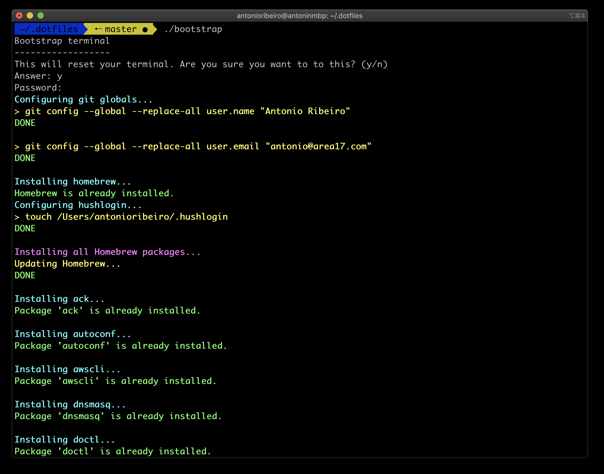
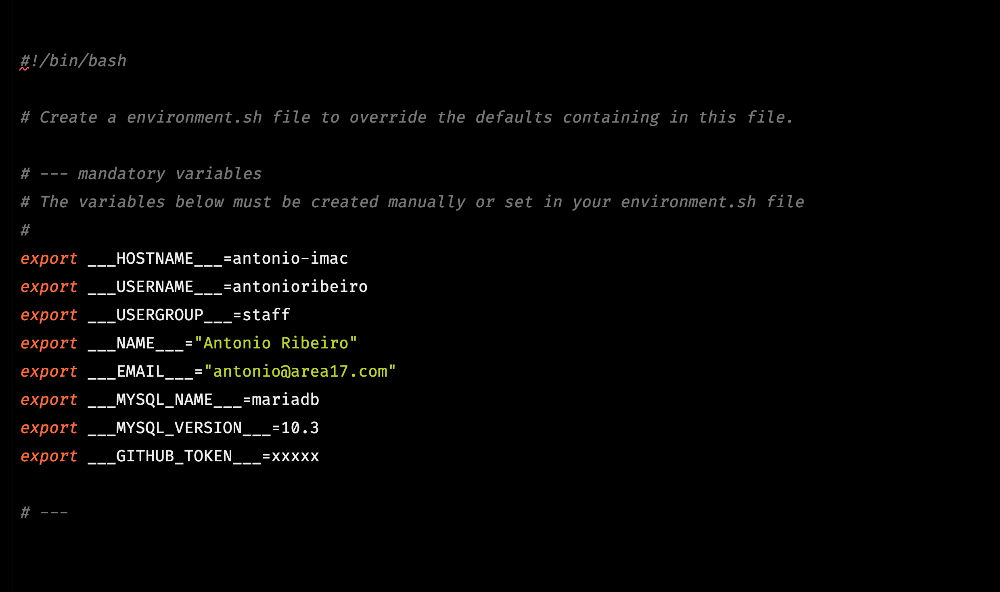

# Our personal dotfiles

This is an (almost) full rewrite of the popular [.dotfiles](https://github.com/freekmurze/dotfiles) script wrote by Freek Van der Herten, where he says:

> "My personal dotfiles. Also used by nearly all other geeks at [spatie.be](http://spatie.be) and [the amazing Frederick Vanbrabant](https://twitter.com/maybeFrederick/status/912620087538016257).
> It contains the installation of some basic tools, some handy aliases and functions. Backups of settings are done via [Mackup](https://github.com/lra/mackup)."



## Installing

You can install them by cloning the repository as `.dotfiles` in your home directory and running the bootstrap script.

#### Git clone it

```
git clone git@github.com:antonioribeiro/dotfiles.git .dotfiles
cd .dotfiles
```

#### Edit the .environment file

Rename `.environment.defaults.sh` to `.environment.sh`, and add your personal information to the **mandatory variables**, name, email, Github token, etc. 
But yoy can also use it to change other root stuff, like executable names.



#### Select your packages

You can rename the .defaults to remove or add more packages to be installed.

#### Edit the `base.sh` file

Take a quick look at it, if you don't want to see something installed, this is the `core` of the install process, and I made it simple on purpose, because sometimes we don't everything.

#### Execute the installer

```
./bootstrap
```

## What it does?

Well... the original one was already fantastic, so this one basically does the same, by giving you more control and information.

### More information about the process

I struggled with things not installing because of some minor errors, when the original script kept going and in the end something was missing. So it know handles errors and gives information about them. It also shows you the command it is currently running to install somethimg, you can just copy and paste to reproduce the problem.

### Halt on exceptions

It has an exception handler that tries to catch errors and, if something bad happens, it will stop and try to show the full error message.

### Watch progress

Not progress, progress, but it will only display short messages so you can actually know what it's doing at the moment.

### Install, reinstall or skip

It will actually check if something is installed, like a brew package, and inform that it is already installed.

### Change installers

You can use the `.environment` file to change any executable path of even the installer, like `npm` by `yarn`, if you need. 

### Installer command

If you need to install or reinstall something, you don't have to go through the whole process again, you just:

```
./install nginx
```

### Disable anything

It has these `.defaults` files like `.brew_packages.default.sh` which can be renamed to `.brew_packages.sh` and modified to remove or add any brew packages you want to see installed. And it's the same for **Brew cask**, **NPM**, **Composer** and **Pecl**. 

If you want to disable deeper, it also has this new `base.sh` script where you can disable any installer you don't want run on your machine by commenting only one line:

Disabling PHP for example: 


```
#!/bin/bash

#---
# Keep this file clean to avoid genral failures
#---

function install
{
    ...
    
    install_brew_packages

    install_ohmyzsh

    # install_php

    ...
}
```

## Enjoy!!

Feel free to create issues and pull requests on this repo, if you have any questions or want to help improve it.

